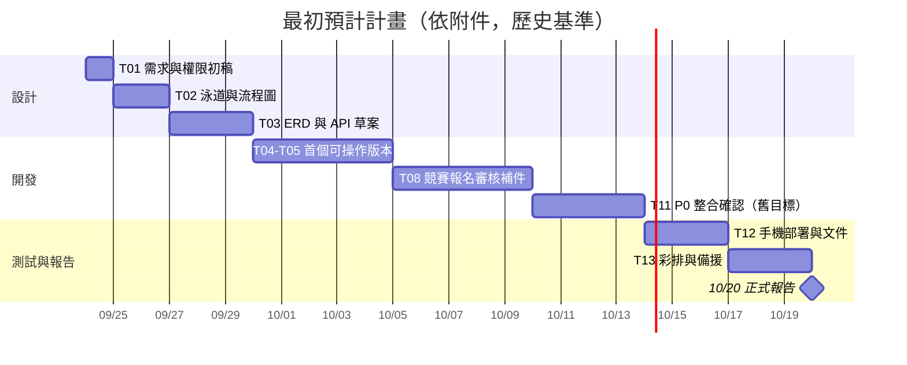
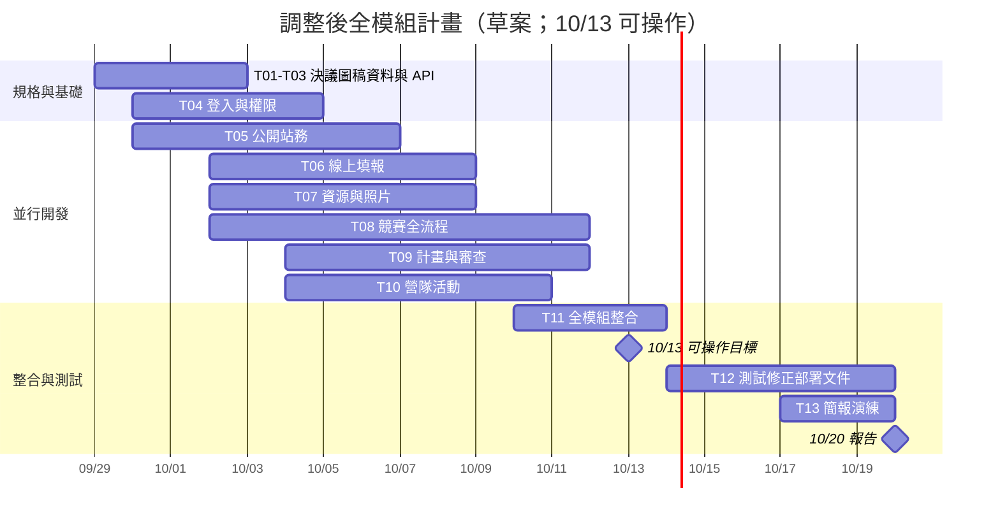

# 專題排程｜最初計畫、調整後計畫與實際執行

> 建立日期：2026-09-29。**最初計畫**依使用者提供的排程圖片轉錄並保留其原意；**調整後計畫**依最新「10/13 前全部模組可操作」目標編排，日期是待小組核定的草案；**實際執行**須由成員回報及成果證據填寫，本文沒有推定任何任務已完成。

## 讀法與共同任務編號

| 編號 | 工作項目 |
| --- | --- |
| T01 | 需求、網站地圖、功能範圍與權限確認 |
| T02 | 泳道圖與流程圖 |
| T03 | ERD、API、Git 與開發環境 |
| T04 | 登入、帳號、角色及承辦授權 |
| T05 | 公開網站、公告與站務內容 |
| T06 | 線上調查填報、查詢及匯出 |
| T07 | 教學資源與成果照片上傳、搜尋及下載 |
| T08 | 競賽建立、報名、審核補件、產檔、抽籤、成績及公告 |
| T09 | 計畫填報、經費概算與兩階段審查 |
| T10 | 營隊活動、訪客報名及匯出 |
| T11 | 全模組整合、錯誤修正與可操作確認 |
| T12 | 手機畫面、部署、操作文件、整合測試 |
| T13 | 簡報、展示腳本、演練與正式報告 |

各表中的「原計畫未列」意指圖片沒有獨立安排該項，**不表示當時決定不做**。表中的 A／B／C／D 沿用原圖代稱，並非已確認姓名或目前分工。

## 一、最初預計計畫（歷史基準，保留原意）

以下依附件逐列轉錄。這一節不得隨後續進度覆寫；若轉錄文字有誤，另註勘誤。

| 日期 | 全組要完成的事 | 分工重點（原圖） | 對照任務 |
| --- | --- | --- | --- |
| 9/24 | 討論需求，整理網站地圖、功能範圍表、角色權限表初稿 | 全組逐項標出「已決定／待確認」 | T01 |
| 9/25–9/26 | 畫完泳道圖與流程圖，開會核對角色、分支和結束條件 | A：登入與角色；B：公告發布；C：建賽到報名；D：審核與補件 | T02 |
| 9/27–9/29 | 定資料表 ERD、API 草案、Git 專案與開發環境 | A 統整資料與權限；B–D 確認各自畫面和 API 需要的欄位 | T03 |
| 9/30–10/4 | 做出第一個可操作版本 | 管理員發布公告後，訪客能在首頁讀到 | T04、T05 |
| 10/5–10/9 | 接通競賽建立、學校報名、審核補件 | 用三種角色的測試帳號走完整流程 | T08 |
| 10/10–10/13 | 修整合問題，確認 P0 功能 | 10/13 建議停止新增功能，記錄尚未解決的問題 | T11；**此處是當時舊目標** |
| 10/14–10/16 | 測試手機畫面、部署、操作文件與簡報 | 請非開發該功能的組員照文件實際操作 | T12、T13 |
| 10/17–10/19 | 彩排、修展示問題、準備備援畫面 | 練習在限定報告時間內完成展示 | T13 |
| 10/20 | 正式報告與展示 | 四人按展示腳本交接 | T13 |

原圖未獨立排入 T06、T07、T09、T10；現行決議要求將它們納入 10/13 可操作目標。原圖「確認 P0 功能」也已被後續全模組目標取代，故保留為歷史而非目前工作範圍。

## 二、調整後計畫（2026-09-29 草案，待小組核定）

**已確認的里程碑**：10/13 前全部模組可操作；10/14–10/19 測試與修正；10/20 報告。下表的模組起迄日是為達成里程碑所提的**排程建議**，不是已承諾的組員工時或實際完成日。多模組需並行；四人分工與可投入時間尚待確認。

| 任務 | 建議期間 | 驗收／交接點 | 負責人 |
| --- | --- | --- | --- |
| T01–T03 | 9/29–10/2 | 決議、圖稿、ERD/API 第一版可供實作，待確認項有標註。 | 待分工 |
| T04 | 9/30–10/4 | 測試帳號可驗證一般、承辦、管理員權限與跨校拒絕。 | 待分工 |
| T05 | 9/30–10/6 | 公告與站務內容可管理並在公開頁依設定呈現。 | 待分工 |
| T06 | 10/2–10/8 | 指定學校填調查表，管理員查未填與匯出。 | 待分工 |
| T07 | 10/2–10/8 | 各已註冊學校可上傳兩類資料，管理員設定／下載。 | 待分工 |
| T08 | 10/2–10/11 | 從授權、建賽、報名到補件、產檔、抽籤與成績可用測試資料走通。 | 待分工 |
| T09 | 10/4–10/11 | 學校填計畫／經費，管理員兩階段審查並控制公開。 | 待分工 |
| T10 | 10/4–10/10 | 訪客免登入報營隊，管理員設定及匯出。 | 待分工 |
| T11 | 10/10–10/13 | 串接、修正阻斷問題；10/13 前全模組可操作。 | 全組，細分待定 |
| T12 | 10/14–10/19 | 手機、權限、資料範圍、正反分支、部署與操作文件測試；記錄缺陷並修正。 | 全組，細分待定 |
| T13 | 10/17–10/20 | 完成簡報、展示腳本與演練；10/20 報告。 | 全組，細分待定 |

## 三、實際執行紀錄（待回報，不以計畫推定）

| 任務 | 實際開始 | 實際完成 | 實際負責人 | 狀態／成果證據 | 與調整後計畫的差異 |
| --- | --- | --- | --- | --- | --- |
| T01 | 未回報 | 未回報 | 未回報 | 未回報 | 待填 |
| T02 | 未回報 | 未回報 | 未回報 | 未回報 | 待填 |
| T03 | 未回報 | 未回報 | 未回報 | 未回報 | 待填 |
| T04 | 未回報 | 未回報 | 未回報 | 未回報 | 待填 |
| T05 | 未回報 | 未回報 | 未回報 | 未回報 | 待填 |
| T06 | 未回報 | 未回報 | 未回報 | 未回報 | 待填 |
| T07 | 未回報 | 未回報 | 未回報 | 未回報 | 待填 |
| T08 | 未回報 | 未回報 | 未回報 | 未回報 | 待填 |
| T09 | 未回報 | 未回報 | 未回報 | 未回報 | 待填 |
| T10 | 未回報 | 未回報 | 未回報 | 未回報 | 待填 |
| T11 | 未回報 | 未回報 | 未回報 | 未回報 | 待填 |
| T12 | 未回報 | 未回報 | 未回報 | 未回報 | 待填 |
| T13 | 未回報 | 未回報 | 未回報 | 未回報 | 待填 |

取得實際日期後，以上表為資料來源新增「實際執行甘特圖」，並保留最初與調整後兩張計畫圖。未回報時不畫虛構的實際進度條。

## 四、排程變更紀錄

| 日期 | 變更 | 原因 |
| --- | --- | --- |
| 2026-09-29 | 保留附件最初預計計畫，另新增全模組調整後計畫與實際欄。 | 使用者要求能對照最初期望與後續實際；P0～P2 全模組納入 10/13 目標。 |

後續若延誤或調整，記錄變更日期、受影響任務、原因與新預計日期；**不要回頭修改最初計畫**。
